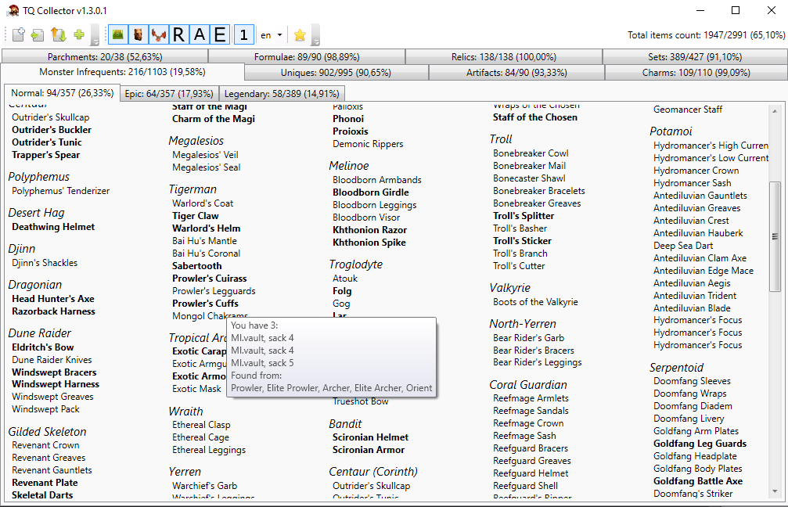

# TQCollector
Source/binaries for TQCollector, a tool for item collectors in Titan Quest including all expansions. Check which items are missing from your collection. Works well together with [TQVault](https://github.com/EtienneLamoureux/TQVaultAE)

## Contributors
- BeaverusIV (original author, development 2009 - 2018)
- Malgardian / spectre (item locations, updates and maintenance 2018 - current year)
- JJ Ying (TQ icon)
- Sekkyumu (toolbar icons, except TQ expansion icons)
- bman654 and contributors (TQVault code for opening TQ files)
- Arperum (bug testing/fixing)
- hguy (JSON parser for TQVault v4.0+ files)
- Translators:
  - German: Malgardian
  - French: AlcyonV, Wagi, W.N.G.
